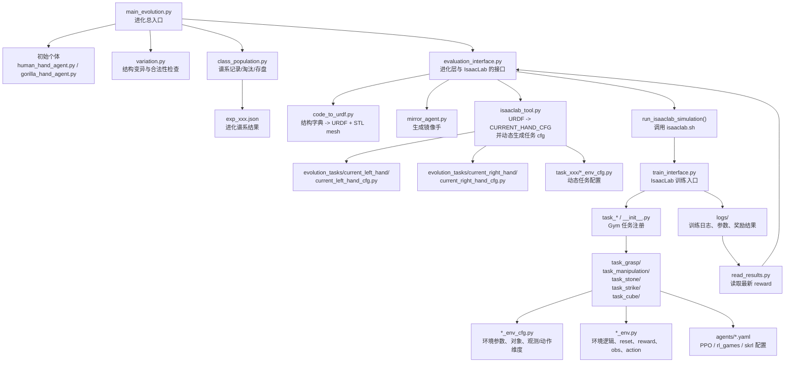

# Evolution 项目说明

## 1. 项目是什么

`Evolution` 是一个面向机器人灵巧手结构搜索的研究型项目。  
它把“手部结构进化”和“IsaacLab 中的强化学习任务评估”连接起来，形成如下闭环：

1. 先定义一只初始手的结构。
2. 对结构做变异，生成新个体。
3. 把结构字典转成 URDF、mesh 和 IsaacLab 可加载配置。
4. 在 IsaacLab 中跑任务训练/评估。
5. 用任务得分作为适应度，筛选个体并进入下一代。

所以它不是单纯的强化学习项目，也不是单纯的 URDF 生成工具，而是一个：

**“机器人手结构进化 + 仿真任务自动评估 + 强化学习训练”一体化实验平台。**

---

## 2. 顶层目录作用

项目根目录目前主要分为两部分：

- `Isaaclab_other/`
  - 负责结构进化、URDF 生成、镜像手生成、调用 IsaacLab 评估
- `evolution_tasks/`
  - 负责 IsaacLab 任务注册、环境定义、奖励函数、训练入口、日志输出

可以把它理解成：

- `Isaaclab_other` 决定“生成什么样的手、怎么评估它”
- `evolution_tasks` 决定“这只手在仿真里做什么任务、如何得到分数”

---

## 3. 完整结构图



---

## 4. 推荐阅读顺序

如果你想最快理解这个项目，建议按下面顺序读：

1. `Isaaclab_other/main_evolution.py`
2. `Isaaclab_other/evaluation_interface.py`
3. `Isaaclab_other/code_to_urdf.py`
4. `Isaaclab_other/isaaclab_tool.py`
5. `evolution_tasks/task_stone/__init__.py`
6. `evolution_tasks/task_stone/evolution_stone_grind_env_cfg.py`
7. `evolution_tasks/task_stone/evolution_stone_grind_env.py`
8. `evolution_tasks/train_interface.py`

这是当前最清晰的一条主干调用链：

```text
main_evolution.py
  -> evaluation_interface.py
  -> code_to_urdf.py
  -> isaaclab_tool.py
  -> evolution_tasks/task_stone/__init__.py
  -> evolution_stone_grind_env_cfg.py
  -> evolution_stone_grind_env.py
  -> train_interface.py
  -> logs / reward
  -> 回到进化循环
```

---

## 5. 两大子系统详解

### 5.1 `Isaaclab_other/`：结构进化与评估调度层

这一层是项目的“上游控制器”，负责定义进化规则，并把结构送进 IsaacLab。

#### 核心文件

##### `main_evolution.py`

这是整个项目的总入口，负责：

- 设置最大代数、种群大小、单个个体的变异次数
- 定义当前评估任务，例如 `Isaac-EvolutionHand-StoneGrind-v0`
- 指定 IsaacLab 中需要被覆盖的 URDF、cfg、日志路径
- 初始化种群
- 对每一代个体做变异、仿真评分、加入谱系、淘汰低分个体

可以把它理解成：

**“进化算法主循环控制器”**

#### `class_population.py`

负责谱系管理：

- 记录父子关系
- 记录个体结构和得分
- 根据得分淘汰个体
- 将谱系保存为 JSON
- 从 JSON 恢复进化状态

可以把它理解成：

**“种群数据库 + 淘汰器”**

#### `variation.py`

负责结构变异和结构合法性检查，主要包括：

- 改 link 长度
- 改 link 半径
- 改 joint 位姿
- 改拇指长度
- 改掌面曲率
- 检查拓扑是否连通
- 检查几何参数是否合理
- 检查关节父子关系是否合法

可以把它理解成：

**“结构编辑器 + 物理约束过滤器”**

#### `evaluation_interface.py`

这是最关键的桥接层，负责：

1. 删除旧的 URDF 和 mesh
2. 把当前结构字典生成新的 URDF
3. 自动生成 IsaacLab 的 `CURRENT_HAND_CFG`
4. 自动生成镜像手
5. 自动修改任务环境配置
6. 用命令行调用 IsaacLab 训练入口
7. 训练后从日志目录读取 reward

可以把它理解成：

**“进化程序 <-> IsaacLab 仿真系统接口层”**

#### `code_to_urdf.py`

负责把 Python 中描述手部结构的字典转换成：

- `.urdf`
- `.stl` mesh

支持的几何类型包括：

- `capsule`
- `cylinder`
- `box`

这是从“抽象结构表示”到“真实可仿真模型”的关键一步。

#### `isaaclab_tool.py`

这是一个自动生成工具层，主要负责：

- 解析 URDF
- 自动生成 `ArticulationCfg`
- 自动提取 joint 和 link 名称
- 根据不同任务生成不同的 env cfg 文件
- 给左右手任务生成动态的动作/观测配置

可以把它理解成：

**“把机器人结构自动接入 IsaacLab 代码体系的适配器”**

#### 其他重要文件

- `human_hand_agent.py`
  - 定义人手初始结构
- `gorilla_hand_agent.py`
  - 定义另一类初始结构
- `mirror_agent.py`
  - 生成镜像手，供双手任务使用
- `read_results.py`
  - 从日志目录读取训练完成标记和 reward
- `tools.py`
  - 结构操作和辅助函数集合

---

### 5.2 `evolution_tasks/`：IsaacLab 任务与训练层

这一层是项目的“下游仿真执行器”，负责真正定义任务环境和 RL 训练过程。

目录下主要有这些任务：

- `task_cube/`
- `task_grasp/`
- `task_manipulation/`
- `task_stone/`
- `task_strike/`

每个任务目录通常都有三类核心文件：

1. `__init__.py`
   - 注册 Gym/IsaacLab 任务 ID
2. `*_env_cfg.py`
   - 定义环境配置、对象、动作空间、观测空间、随机化参数
3. `*_env.py`
   - 定义环境逻辑、reward、reset、step、obs、action 应用

另外还有：

- `agents/*.yaml`
  - RL-Games、skrl 等算法配置

---

## 6. 当前最核心的任务：`task_stone/`

从当前主入口设置来看，默认进化评估任务是：

```text
Isaac-EvolutionHand-StoneGrind-v0
```

也就是说，现在这个项目的主线不是 cube、grasp 或 strike，而是：

**“双手/进化手参与 stone grinding 类任务，并用这个任务结果评价结构优劣。”**

### `task_stone/__init__.py`

这里注册了两个重要任务：

- `Isaac-ShadowHand-StoneGrind-v0`
  - 标准 ShadowHand 基线任务
- `Isaac-EvolutionHand-StoneGrind-v0`
  - 进化手对应的任务

这说明项目是在用：

- 标准手作为基线
- 进化手作为实验对象

进行同类任务对比。

### `evolution_stone_grind_env_cfg.py`

这个文件非常关键，因为它决定当前被进化结构评估时，IsaacLab 里到底加载什么。

它主要定义：

- 左手和右手的 `CURRENT_HAND_CFG`
- 双手的初始位置和旋转
- `possible_agents = ["right_hand", "left_hand"]`
- 多智能体 action/observation/state 维度
- 圆锥体、抓取物体、接触传感器配置
- 随机化参数、摩擦参数、质量参数

它的本质是：

**“当前默认评估任务的实验配置总表”**

### `evolution_stone_grind_env.py`

这是当前默认任务的真正环境实现。  
它负责：

- 创建左右手 articulation
- 创建物体与接触传感器
- 处理动作输入
- 把动作映射到关节 target
- 更新环境状态
- 计算 reward
- 管理成功率和 episode 行为

它本质上回答了一个问题：

**“一只进化出来的手，在 stone grinding 任务里到底如何被打分？”**

---

## 7. 训练入口：`train_interface.py`

这个文件是 IsaacLab 侧的训练主入口，属于项目运行时必读文件。

它主要完成：

- 解析命令行参数
- 启动 Isaac Sim / IsaacLab
- 通过 Hydra 加载 task cfg 和 agent cfg
- 创建 gym 环境
- 包装成 RL-Games 可训练环境
- 调用 `Runner` 进行 PPO 训练
- 将 env/agent 配置写入日志目录
- 在训练完成后创建 `finished` 标记目录

所以它不是“进化算法”的入口，而是：

**“每次结构评估时，单次仿真训练/评估的执行入口”**

---

## 8. 项目中的核心数据流

项目主数据流可以概括为：

### 8.1 结构流

```text
initial_agent_hand
  -> 结构字典
  -> variation()
  -> 新结构字典
  -> code_to_urdf.py
  -> URDF + STL
  -> isaaclab_tool.py
  -> CURRENT_HAND_CFG / env cfg
```

### 8.2 训练评估流

```text
CURRENT_HAND_CFG + task env
  -> train_interface.py
  -> IsaacLab 环境创建
  -> RL-Games / PPO 训练
  -> logs/
  -> read_results.py
  -> reward score
```

### 8.3 进化闭环

```text
reward score
  -> class_population.py
  -> 谱系更新
  -> 淘汰低分个体
  -> 生成下一代
```

---

## 9. 哪些文件最核心

如果只挑“必须看”的文件，我建议按优先级分三层：

### 第一优先级：必须先看

- `Isaaclab_other/main_evolution.py`
- `Isaaclab_other/evaluation_interface.py`
- `evolution_tasks/train_interface.py`

这三者分别代表：

- 谁在调度进化
- 谁在连接 IsaacLab
- 谁在执行训练

### 第二优先级：理解结构生成必看

- `Isaaclab_other/variation.py`
- `Isaaclab_other/class_population.py`
- `Isaaclab_other/code_to_urdf.py`
- `Isaaclab_other/isaaclab_tool.py`

### 第三优先级：理解任务评分必看

- `evolution_tasks/task_stone/__init__.py`
- `evolution_tasks/task_stone/evolution_stone_grind_env_cfg.py`
- `evolution_tasks/task_stone/evolution_stone_grind_env.py`

---

## 10. 从哪里开始读最合适

如果你的目标是：

### 目标 A：快速知道项目整体在做什么

先读：

1. `Isaaclab_other/main_evolution.py`
2. `Isaaclab_other/evaluation_interface.py`
3. `evolution_tasks/train_interface.py`

### 目标 B：研究“手是怎么变出来的”

先读：

1. `Isaaclab_other/human_hand_agent.py`
2. `Isaaclab_other/variation.py`
3. `Isaaclab_other/tools.py`
4. `Isaaclab_other/code_to_urdf.py`

### 目标 C：研究“手是怎么被评分的”

先读：

1. `evolution_tasks/task_stone/__init__.py`
2. `evolution_tasks/task_stone/evolution_stone_grind_env_cfg.py`
3. `evolution_tasks/task_stone/evolution_stone_grind_env.py`
4. `evolution_tasks/train_interface.py`

---

## 11. 当前项目的代码特点

这个项目明显是研究型原型，特点包括：

- 存在大量绝对路径硬编码
- 自动生成代码和手工修改代码混用
- 有较多旧版本脚本和实验残留
- 任务分支较多，但主线目前集中在 `StoneGrind`
- 配置自动化尚未完全闭环，例如观测维度仍有固定值写法

所以阅读时最重要的策略不是“把所有文件都看完”，而是：

**先抓主链路，再按问题回溯子模块。**

---

## 12. 一句话总结

`Evolution` 的本质是一个：

**利用进化算法生成机器人手结构，并通过 IsaacLab 强化学习任务自动评估其性能的研究平台。**

当前最值得优先理解的主线是：

**`main_evolution.py -> evaluation_interface.py -> task_stone -> train_interface.py`**
